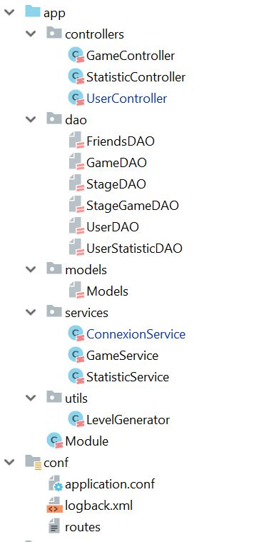
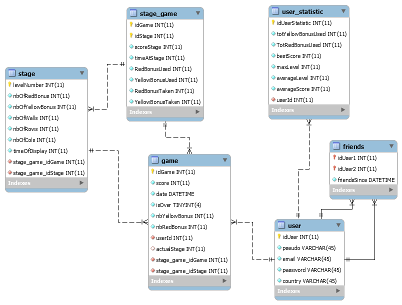

# Memoria
Basile Châtillon, Rémi Jacquemard, François Quellec

# Description
Ce jeu a été mis en ligne. Hébergé sur github pages, il est disponible à l'adresse http://memoria.cf/.
Le backend a été déployé sur Heroku. Les requêtes REST peuvent être effectuées sur http://api.memoria.cf/.
Les deux repos associés sont disponibles sur github à l'adresse suivante: https://github.com/Memoria-Game.

## Objectif
Dans le cadre du cours Scala enseigné à la Heig-vd, nous allons implémenter un jeu de type "casse-tête" à l’aide du Play framework, slick et un front-end en utilisant bootstrap pour le design et Javascript. Les objectifs sont les suivants : 
1. Implémenter une base de données avec un minimum de 3-5 tables et l’intégrer au projet avec slick.
2. Implementer la logique du jeu en Scala avec l’aide du Play framework. 
3. Implémenter le front-end de l’applicatif et l’intégrer au projet.

Pour ce faire, les technologies suivantes ont été utilisées:
 - **Backend**: Scala (langage), Scala Play framework (MVC backend), Slick (FRM)
 - **Fontend**: HTML, CSS, Bootstrap, Javascript, MySQL, Phaser.js

## Utilisation 
L’utilisation de l’applicatif se fait pour le client à partir d’une application web. Une fois la page web visitée, il suffit ensuite au client de se connecter (ou créer un compte). Une fois cette étape achevée, le client peut accéder à ses statistiques, celles de ses amis et au jeu

## Règles du jeu 
Les règles du jeu sont les suivantes :

1. Un damier de cartes s’affiche à l’écran. 
2. Les cartes se retournent pendant 5 secondes. Celles-ci peuvent avoir 3 valeurs, un bonus rouge, un bonus jaune ou une croix. 
3. Une fois les cartes faces cachées, le joueur peut contrôler un pion avec les flèches du clavier. Il commence à l’extrémité gauche et doit se rendre à l’extrémité droite.
4. Si le joueur passe sur cinq bonus rouges, il obtient une vie supplémentaire. 
5. Si le joueur passe sur cinq bonus jaunes, il obtient un bonus qui lui permet de retourner les cartes pendant 5 secondes. Ce bonus est non cumulabe. 
6. Si le joueur passe sur une croix, il perd une vie. Si le joueur possède encore des vie, le jeu continue. Si non, il meurt et le jeu recommence au niveau 0. 
7. Si le joueur atteint l’extrémité droite, il passe au niveau suivant et augmente son score (retour à l’étape 1). Le nombre de murs, bonus change avec le niveau. Le score s’adapte en fonction de la rapidité du joueur à finir/ nombre de bonus pris

## Public cible
Cette application se place dans le domaine récréatif, elle ne cible pas un public en particulier. Cependant, aux premiers abords, les moins de 30 ans semblent plus disposés à utiliser cette application.

## Fonctionalités
Cette section énumère les fonctionnalités attendues du programme : 
1. Front-end :  
    1. Pages web principales : Statistiques, Jeu, Connexion 
    2. Jouer à un niveau particulier (Phaser.Js) 
2. Back-end : 
    1. Vérifier les identifiants de connexion et inscription 
    2. Fournir au jeu frontend les informations du niveau (score courant, niveau courant, temps d'affichage des cartes, localisation des bonus et malus, entrée, sortie du puzzle). Permet de reprendre une partie déjà commencée ou simplement de passer au niveau supérieur.
    3. Générer les niveaux 
    4. Récolter, après qu’un joueur ai finit un niveau, les informations de jeu (temps de jeu, succès, nombre de bonus) 
    5. Gérer et fournir les statistiques au front-end. 
    6. Gérer et fournir les amis au front-end.

# Implémentation
## Backend
Le backend utilise le framework Scala Play. Il a été créé à partir du template https://github.com/SoftEng-HEIGVD/Teaching-HEIGVD-SCALA-Play-Framework-Examples/tree/fb-play-slick-app. 

### Architecture

L'application est structurée ainsi:
- **controllers**: Contient la liste des controlleurs de notre application. C'est ici que les requêtes utilisateurs faites à l'API REST arrive. Il utilise des services.
- **dao**: Présente les DAO de notre système: les mappings ainsi que les différentes requêtes faîtes à la base de données y sont présents
- **models** : Présente les modèles (entités) de la base de donnée 
- **services** : Contient différents services. La logique métier de l'application s'y trouve. Un service utilise les DAO afin d'effectuer certaines actions en base de donnée.
- **util/LevelGenerator**: fichier Scala d'aide à la génération de niveaux
- **conf**: contient les fichiers de configurations de notre application, notamment le fichier *routes* présentant les différents endpoints exposés, et mappant ceux-ci à des méthodes présentes dans les controlleurs.

### Base de données
Afin de faire persister les données, une base de donnée a été créée, interfacée à l'aide de Slick.

Il faudra noter que celle-ci a légèrement différer par rapport à ce qui avait été décrit dans le cahier des charges. Par exemple, concernant les statistiques, il a semblé meilleur d'ajouter une table *statistics* afin de faciliter et rendre plus claires certaines requêtes.

### Gestions d'utilisateurs
Un système de compte utilisateur a été mis en place. Il est possible de créer un compte, se connecter et se déconnecter à l'aide des endpoints REST suivant:
- **POST** /signup: permet de créer un compte. Body: *{"pseudo": Dream, "email": "basile.ch@htomail.ch", "pwd": "1234", "country":switzerland }*
- **POST** /sigin: permet de connecter un utilisateur. Body: *{"pseudo": Dream, "pwd": Hash}*.
- **GET** /logout: permet à l'utilisateur de se déconnecter

Le système de session fournit par Scala Play est utilisé afin de garder l'utilisateur connecté. Lors de sa connexion, on vérifie en base de donnée si les informations fournies sont correctes. Si c'est le cas, l'id d'utilisateur est stocké dans la session. Il est ainsi facilement possible de récupérer l'utilisateur à partir de son identifiant dans les requêtes suivantes.

Par la suite, toute les requêtes dont il est nécessaire qu'un utilisateur soit connecté sont filtrées. S'il n'y a aucun utilisateur connecté, le serveur répond par une erreur 403.

### Gestion des parties
Afin de gérer les parties, 4 endpoints ont été créés:
- **POST** /game/endStage: permet d'indiquer que le niveau courant a été terminé par l'utilisateur. On y indique aussi l'utilisateur a terminé ce niveau, ou s'il n'a pas réussi. Body: *{StageClear: true, temps: 12:00, score: 10212, yellowBonusTot: 3, redBonusTot: 4, yellowBonusUsed: 1, redBonusUsed: 0}*
- **GET** /game/user/:user_id: permet de récupérer la liste des parties pour le joueur indiqué en paramètre de requêtes. Body response: *[{idGame: 1, score: 123, date: Timestamp, isOver: fasle, nbYellowBonus: 1, nbRedBonus: 1, userId: 1, actualStage: Long }, ...]*
- **GET** /game/nextStage: Permet de récupérer les information du prochain niveau, ou du niveau courant si l'utilisateur se reconnecte alors qu'une partie est en cours. Body response: *{stageLevel: 13, map: [tableau]}*
- **GET** /game/resume: Méthode utilisée suite à une connexions. Les informations de base qui doivent être affichée à l'utilisateur y sont présentes. Body response: *{score:12101, yellowBonus: 12, redBonus: 2}*

Le endpoint */game/resume* s'occupe de créer une nouvelle partie automatiquement si tel est nécessaire. De la même manière, */game/nextStage* crée un niveau automatiquement si tel est nécessaire.

Dans le contrôleur associé, les services *GameService* et *StatisticService* sont fortement utilisés afin de gérer toute la logique de jeu et de sauvegarder les statistiques

### Gestion des statistiques
Lorsque l'utilisateur envoie des informations concernant sa partie, des statistiques sont insérées dans une table spécialisée de la base de données. Ces informations sont ensuite récupérables à l'aide des endpoints présenté ci-après. Il faut noter que certains traitements sont effectués dans le *StatisticService* afin de mettre en forme les données sous forme utilisable par l'utilisateur.
- **GET** /statistics/personnal: permet de récupérer les statistiques personnels. Body response: *{totYellowBonusUsed:10, totRedBonusUsed:12, bestScore: 19, maxLevel, averageLevel, averageScore}*
- **GET** /statistics/personnalScore: permet de récupérer la liste des scores de toute les parties effectuées. Body response: **[{"score": 12, "date": 12.10.2018}, ...]*
- **GET** /statistics/countries/home: permet de récupérer les statistiques concernant le pays de l'utilisateur. Body response: *{"contry":Switzerland, "nbPlayer": 3, "bestScore": 12 }*
- **GET** /statistics/friends: permet de récupérer les statistiques concernant les amis de l'utilisateurs. Body response: *[{"name": Fanfou, "bestScore": 12, "maxLevel": 10}, ... }*
- **GET** /statistics/countries: permet de récupérer les statistiques par pays. Body response: *[{"contry":Switzerland, "nbPlayer": 3, "bestScore": 12 }, {{"contry":tiers-monde (france LOL), "nbPlayer": 1, "bestScore": -3 }, ...]*
- **POST** /statistics/add_friend: permet d'ajouter un ami qu'on peut suivre à l'aide de son pseudo. L'ajoute à la liste des amis de l'utilisateurs courant. Body response: *{"pseudo":Fanfou}*

## Frontend
Ici est décrit le frontend de notre application.

Les formulaires d'inscription et de connexion envoient des requêtes à l'API REST développée. Une fois l'utilisateur loggé, la session, présente dans la réponse du serveur, est sauvegardée dans le client. Par la suite, toute les requêtes effectuées au serveur renvoie cet session dans les en-têtes de la requête.

Pour ce qui est du jeu, la librairie *Phaser.js* a été utilisée. Voici les requêtes qui sont effectuées au serveur:

1. le client demande au serveur de reprendre une partie (/game/resume). Une partie est créée automatiquement si aucune n'existe
2. le client demande au serveur le niveau qu'il doit jouer(/game/nextStage)
3. le client joue un niveau
4. une fois le niveau terminé, il en envoie les informations sur le endpoint (/game/endStage). S'il l'a réussi, il passe au niveau suivant (point 2)

Concernant les statistiques, l'utilisateur, lorsqu'il arrive sur la page associée, fait les requêtes nécessaires sur le endpoint "/statistics". Les données ont déjà été mises en forme et sont utilisables facilement par le client sur le serveur. 

# Problèmes rencontrés
On trouvera ci-après une liste de quelques problèmes qui ont été rencontré lors de la réalisation de ce projet.

La gestion des *Future* de scala a été difficile d'accès. En effet, il a été difficile de comprendre comment bien les utiliser, ce qui a pris un certain temps. Aussi, le même problème a été rencontré avec les *Option*. La combinaison des deux *Future[Option[T]]* était aussi difficile à gérer.

Dans les DAO, les contraintes n'étaient pas mappées. On aurait aussi pu penser que, comme par exemple avec Hybernate, il aurait pu être possible de récupérer toutes les Game d'un joueur sans devoir effectuer de *join* manuel.

Il nous manquait aussi certaines connaissance pour bien comprendres la méthodes des Action.async / Action

La création des requêtes pour accéder/modifier/insérer en base de donnée ne sont pas toujours évidentes à définir.

En conclusion, il y a beaucoup de chose intéressante dans Slick et Scala Play. Cependant, il aurait été idéal d'avoir effectué un labo concernant ces technologiques avant l'exécution du projet, afin d'avoir une meilleure idée de comment implémenter le tout de manière propre.